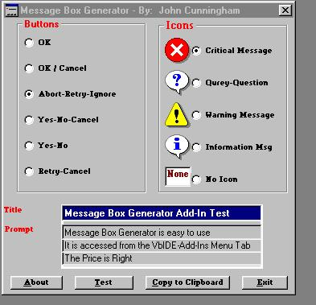



## Message Box Generator

### Description

VB6.0 IDE Add-In, automatically generates Message

Boxes for your programs.
 
### More Info
 
Title; Message; Icon - Copy to Clipboard

Message Box Generator is a DLL. See the Readme

file to install. Once installed the Message Box Generator is availabel through the VB6.0 IDE. Go to the IDE's Menu Bar, select Add-Ins, select Add-In Manager, select Message Box Generator and check

Loaded/Unloaded and Load on Start Up. The Message

Box Generator will then be available from the Add-Ins menu.

Completed Message Box Code - Paste into your program from the Clipboard

             |
---                |---
**Submitted On**   |1999-12-07 00:05:22
**By**             |[John P\. Cunningham](https://github.com/Planet-Source-Code/PSCIndex/blob/master/ByAuthor/john-p-cunningham.md)
**Level**          |Advanced
**User Rating**    |3.8 (15 globes from 4 users)
**Compatibility**  |VB 3\.0, VB 4\.0 \(16\-bit\), VB 4\.0 \(32\-bit\), VB 5\.0, VB 6\.0, VB Script, ASP \(Active Server Pages\) 
**Category**       |[Miscellaneous](https://github.com/Planet-Source-Code/PSCIndex/blob/master/ByCategory/miscellaneous__1-1.md)
**World**          |[Visual Basic](https://github.com/Planet-Source-Code/PSCIndex/blob/master/ByWorld/visual-basic.md)
**Archive File**   |[CODE\_UPLOAD78397162000\.zip](https://github.com/Planet-Source-Code/john-p-cunningham-message-box-generator__1-9811/archive/master.zip)

